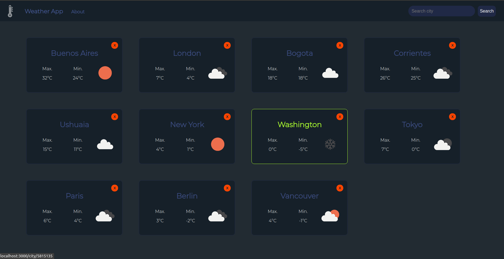
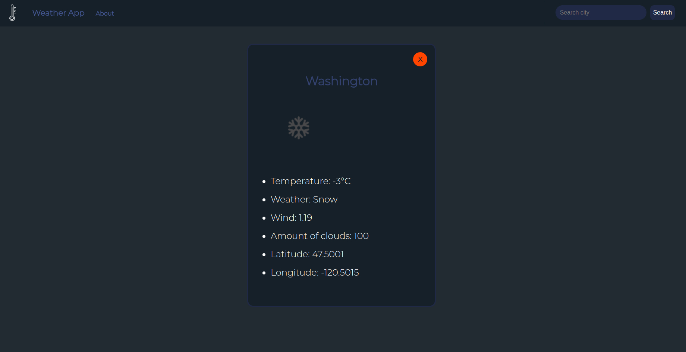

# Weather App

## About the project

Application that allows the user to search weather information from different places around the world.
The data is fetched from an external API.

#### Cities cards

#### City detail

## Technologies used

- JavaScript
- React
- CSS

## Getting started

- Clone repository in your computer.
- Install NodeJS (version >= 12.18.3) and npm (version >= 6.14.16).
- Execute `npm i` on root folder.
- Execute `npm start` on root folder.
- Navigate to `http://localhost:3000` in your browser. 
